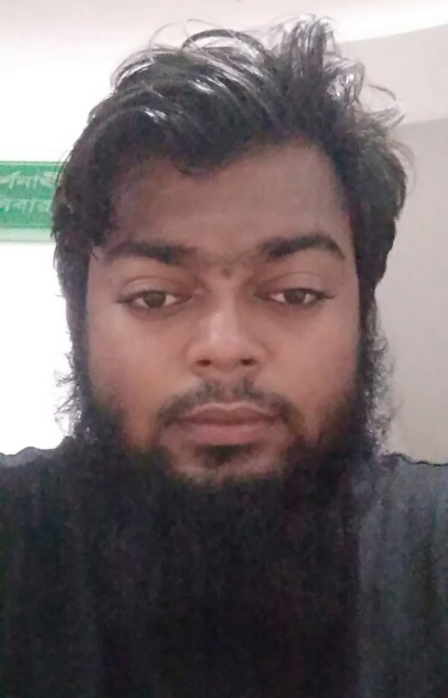

## About Me

Hi! I am md shahid. Graduate from Fareast International University,Dhaka.You can find me on github [GitHub](https://github.com/theshahid)

## Research Interest

Cyber security awareness. Cyber security education. Cyber Open source project. Linux ❤️. Server less project.

## Course Completed

1. Cyber Security by BdREN
2. Infosec by Udemy
3. Build your own cyber lab by Udemy
4. Steps to prevent a web hacker by Udemy

## Course runing
1. Web security by cybrary
2. Cyber security by edX
3. Penetration testing by cybrary
4. Windows Forensics and Tools by cybrary

This is a [link](https://github.com/theshahid) Something *italics* and something **bold**.

## Certificate

Year | Vendor  | Course time
-----|---------|-------------
2019 | BdREN   | 4 week
2019 | Udemy   | self study
2019 | Cybrary | self study

---

Here is a blockquote

> Always be happy

## References

* Head of department ENT.MPI
  Samsul Haque: CI of Electronics faculty,MPI
* Head of Department CSE,FIU
  Fauzia Yasmeen: Associate Professor, Department of Computer Science,FIU.
